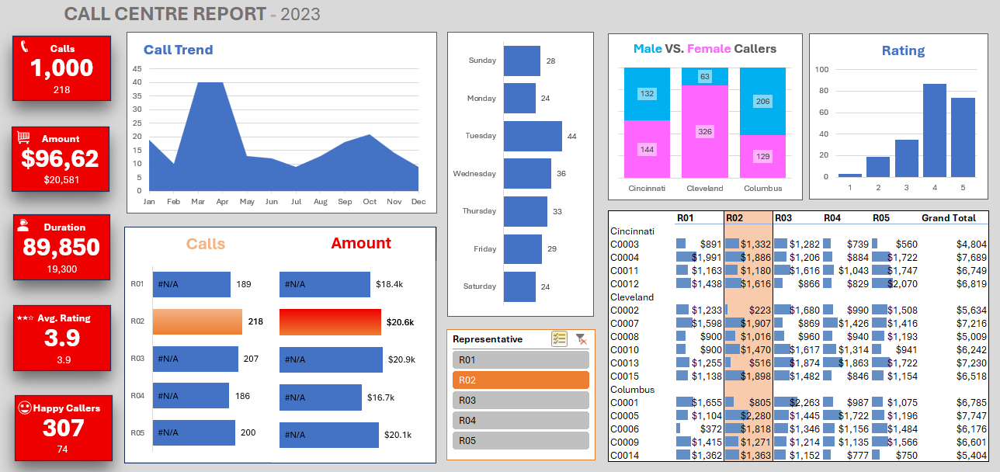

# 📞 Call Centre Dashboard - 2023

An interactive Excel dashboard designed to analyze call center performance data including call volumes, revenue, call durations, and customer satisfaction.

---

## 📂 Project Overview

This project visualizes key call center metrics by using Excel features like Pivot Tables, Slicers, Conditional Formatting, and Charts. The dashboard presents insights by representative, gender, location, and call trends throughout the year.

---

## 📊 Key Features

- 📈 **Call Trend Analysis** – Monthly call volumes shown with clear seasonal patterns.
- 📞 **Calls & Duration** – Total of **1,000 calls** handled, with **89,850 seconds** of total call duration.
- 💰 **Revenue Insights** – Total revenue of **$96,620**, with representative-wise contributions.
- ⭐ **Customer Feedback** – Average rating of **3.9** with **307 happy callers**.
- 👨‍💼 **Rep Comparison** – Performance breakdown by each representative (R01–R05).
- 🔍 **Demographic Insights** – Gender-based comparison across locations.
- 📅 **Weekly Call Patterns** – Visual distribution of call traffic across the week.

---

## 🧰 Files Included

- `Call Centre Data & Assets.xlsx`: Contains raw data for calls, amounts, ratings, durations, etc.
- `Call Centre Dashboard File.xlsx`: Contains pivot tables and the final dashboard.
- `Image_of_Call_Center_Dashboard.png`: Snapshot of the final dashboard view.

---

## 📌 Tools Used

- **Microsoft Excel**  
  - Pivot Tables  
  - Charts  
  - Conditional Formatting  
  - Slicers

---

## 🎯 Purpose

This is a resume-worthy Excel project created to showcase advanced data visualization and dashboarding skills. It helps stakeholders quickly understand operational performance and make data-driven decisions.

---
